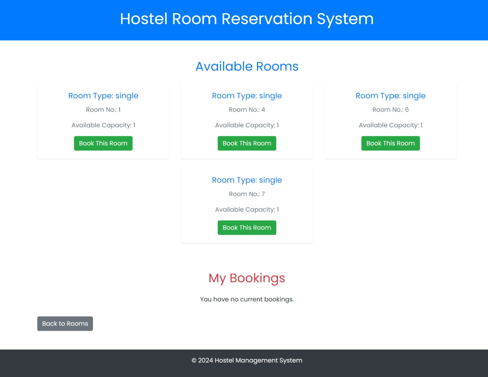

# Hostel Management System

## Screenshots

#### Login Page


#### Sign Up Page


#### Rooms Page


#### Rooms Availability Page

&nbsp;&nbsp;&nbsp;&nbsp;*After Booking*


## Requirements

To run this application, you need a MySQL database named **hostel** with the following tables:

### 1. Students Table
This table stores information about the students.

| Column Name | Data Type             | Constraints        |
|-------------|---------------        |--------------------|
| roll_number | varchar(20)           | PRIMARY KEY        |
| email       | varchar(100)          | UNIQUE             |
| password    | varchar(255)          |                    |
| gender      | enum('Male','Female') |                    |

### 2. Rooms Table
This table stores information about the available rooms.

| Column Name        | Data Type               | Constraints                 |
|--------------------|-------------------------|-----------------------------|
| room_id            | int                     | PRIMARY KEY, auto_increment |
| room_type          | enum('single','triple') |                             |
| gender             | enum('male','female')   |                             |
| total_capacity     | int                     |                             |
| available_capacity | int                     |                             |

**Example Room Data:**
| room_id | room_type | gender | total_capacity | available_capacity  |
|---------|-----------|--------|----------------|---------------------|
| 1       | single    | male   | 1              | 1                   |
| 2       | triple    | female | 3              | 3                   |
| 3       | single    | female | 1              | 1                   |
| 4       | triple    | male   | 3              | 2                   |

### 3. Bookings Table
This table stores information about room bookings made by students.

| Column Name   | Data Type     | Constraints                 |
|---------------|---------------|-----------------------------|
| booking_id    | int           | PRIMARY KEY, auto_increment |
| roll_number   | varchar(50)   | UNIQUE                      |
| room_id       | int           | FOREIGN KEY                 |

## How to Set Up the Database

1. Create the database:
   ```sql
   CREATE DATABASE hostel;
2. Create the tables
    ```sql
    USE hostel;
    CREATE TABLE students (
    roll_number varchar(20) PRIMARY KEY,
    email varchar(100) UNIQUE,
    password varchar(255),
    gender enum('Male', 'Female')
    );

    CREATE TABLE rooms (
    room_id int PRIMARY KEY AUTO_INCREMENT,
    room_type enum('single', 'triple'),
    gender enum('male', 'female'),
    total_capacity int,
    available_capacity int
    );

    CREATE TABLE bookings (
    booking_id int PRIMARY KEY AUTO_INCREMENT,
    roll_number varchar(50) UNIQUE,
    room_id int,
    FOREIGN KEY (room_id) REFERENCES rooms(room_id)
    );

3. Insert the Room Data

### Prerequisites
- Node.js (v14 or higher)
- MySQL Server

### Installation
1. Clone the repository:
```bash
   git clone https://github.com/rudrapriyan/CS19542--Internet-Programming-Lab 
```

2. Navigate to the project directory
```bash
   cd CS19542--Internet-Programming-Lab 
```
3. Install dependencies
```bash
   npm install 
```

### Configuration
1. Create a .env file in the root of the project and set the following variables:
```makefile
    HOST=your_mysql_host
    DB_PORT=your_mysql_port
    USER=your_mysql_user
    PASSWORD=your_mysql_password
    DB=hostel
    PORT=set_your_desired_port
```
### Running the Application
```bash
    node index.js
```

